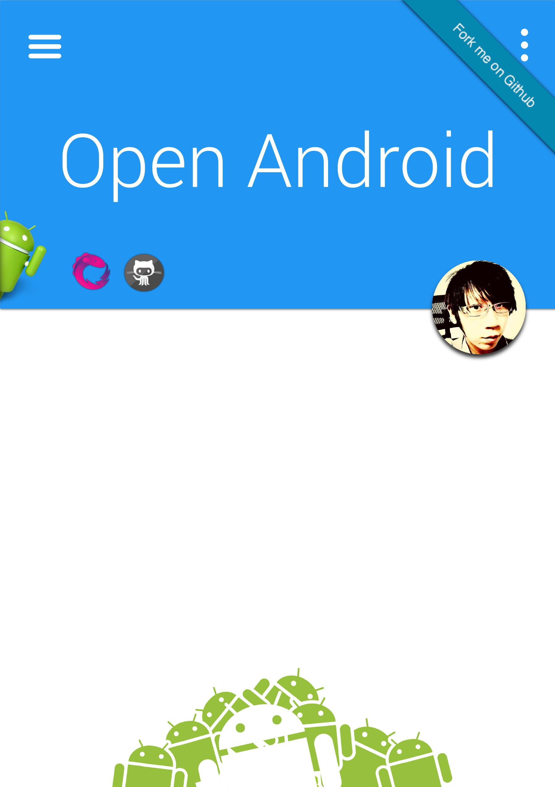

# Android App 開源開發

Android App 以開源角度來開發。

你應該要使用的道具：

* RxJava, RxAndroid
* retrolambda (java7 + java8)
* retrofit
* okhttp
* DI: Dagger2
* AutoParcel, AutoValue, etc.
* ImageLoader: fresco, AUIL, picasso, glide, etc.
* Android Studio
* gradle
* json2pojo: jackson, gson, logansquare, etc.
* Orm: DBFlow, etc.
* SimpleFacebook